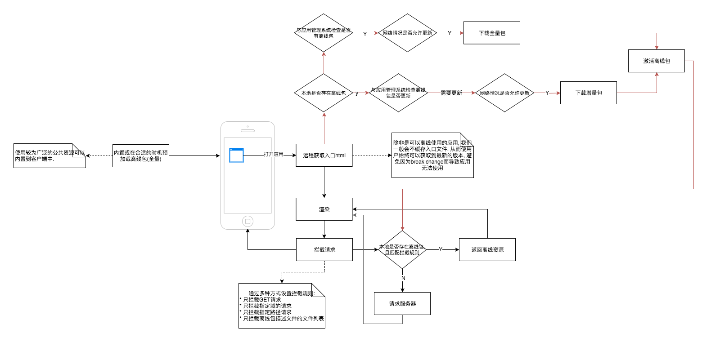

# 离线化方案及对比

- [离线化方案及对比](#离线化方案及对比)
    - [1. 基于现有的浏览器机制](#1-基于现有的浏览器机制)
        - [1.1 基于 HTTP 的缓存机制](#11-基于-http-的缓存机制)
        - [1.2 Application Cache](#12-application-cache)
        - [1.3 PWA](#13-pwa)
        - [1.4 工作宝向下兼容性](#14-工作宝向下兼容性)
    - [2. 传统 Hybrid 方案](#2-传统-hybrid-方案)
        - [2.1 file协议方案(Cordova原理)](#21-file协议方案cordova原理)
        - [2.2 Webview拦截方案](#22-webview拦截方案)
        - [2.3 小程序](#23-小程序)
    - [3. 基于开源的 Native 方案](#3-基于开源的-native-方案)
    - [4. 方案对比](#4-方案对比)
    - [5. 参考文献/扩展阅读](#5-参考文献扩展阅读)


<br/>


图片截取自 [`黄玄的演讲slice`](https://huangxuan.me/sw-101-gdgdf)

<br/>

如上图, 从纯 Web 到纯 Native，之间有许多的解决方案. 不同方案有不同的优缺点和引入成本, 我们会从以下几点来考虑方案的可行性:

* `可用性`: 是指应用接近原生的用户体验性. 性能更高, 操作更流畅
* `引入成本`: 落地需要付出的人力和物力
* `向下兼容性`: 应用能否在低版本的客户端中使用, 或者是否存在`回退方案`
* `复用性`: 是否需要为每个客户端进行适配, 以及适配的成本
* `平台兼容性`: 各种客户端平台的支持性

我们需要根据自己的应用场景和团队能力去选择一个合适的方案. 主要可以划分为三种方案类型:

* 基于现有的浏览器机制
* 基于传统 Hybrid 方案
* 基于开源的 Native 方案

<br>
<br>

## 1. 基于现有的浏览器机制

### 1.1 基于 HTTP 的缓存机制

HTTP 的缓存机制主要是在服务器端通过 HTTP 报头的方式进行控制。其工作流程如下:

<br>


<br>

* `强缓存`：强缓存使用`Expires`和`Cache-Control`来设置. 这两个报头都用于设置一个绝对的过期时间。设置这两个报头的静态资源被加载时，浏览器会检查是否过期，如果未过期，浏览器会直接加载资源，不会向服务器发起请求. 这就是所谓的强缓存
* 协商缓存：协商缓存主要使用以下报头来控制.
  * `Last-Modified/If-Modified-Since`: 使用资源的更新时间来判断是否需要重新请求
  * `Etag/If-None-Match`: 使用资源的`标签`匹配来判断是否要重新请求。`标签`一般是资源的唯一标志，比如内容的 Hash 码

> 注意: html 入口文件不能加`强缓存`

**局限性**:

* 缓存不可靠性:
  * 用户行为对缓存的影响(图片来自: [http 协商缓存 VS 强缓存](http://www.cnblogs.com/wonyun/p/5524617.html))
    

    即用户刷新会导致缓存无效。
  * 缓存由浏览器控制, 无法控制其缓存清理逻辑. 比如在系统资源紧张的情况下, 缓存可以被清理掉
* 对于强缓存的资源，如果未过期，除非用户强制刷新，会一直使用旧的版本。可能会导致程序错误(比如缓存了入口文件)。可以使用 添加查询字符串的方式, 让浏览器放弃缓存
* 无法使用程序干预和控制缓存
* 不支持离线

<br/>
<br/>


### 1.2 Application Cache

HTML5 早期版本提供了`Application Cache`的缓存功能, 在`Service Worker`提出之后，`Application Cache`就从 `Web 标准`中移除了, 在未来浏览器会停止支持(部分浏览器目前会警告)。不过我们可以了解一下他的缓存原理:

<br/>


<br/>

Appcahce 使用`manifest`文件来声明 应该缓存哪些资源, 典型 格式为:

```bash
# 版本号, 修改版本和触发更新
# v1 - 2011-08-13
# 声明要缓存的静态资源
CACHE MANIFEST
http://www.example.com/index.html
http://www.example.com/header.png
http://www.example.com/blah/blah

# 声明绕过缓存, 或者资源不存在时是否可以通过网络请求
# 可以使用通配符, * 表示除了CACHE声明的, 其他使用网络
NETWORK:
network.html

# 回退: 声明当资源无法访问时, 浏览器使用该资源
FALLBACK:
/ fallback.html
```

<br/>

**优点**

* 兼容性好, 但是是废弃的 Web 标准, 未来可能成为历史包袱
* manifest 缓存和浏览器 HTTP 缓存是独立的, 不受其影响. 可以永久缓存

<br/>

**缺点**

* 使用声明式设计声明缓存文件. 不可编程, 比如你无法条件性地缓存. 如果同时支持 PC 端移动端，也会将所有不需要的资源缓存下载
* 不同浏览器实现有些 bug
* API 存在较多设计缺陷. 比如
  * 即使 manifest 文件丢失, 但 html 节点中的 manifest 属性没有删除, 缓存依然有效
  * 全量 缓存, 一旦 manifest 更新, 所有文件将被重新缓存一遍
  * 标记了 manifest 的 html 本身也被缓存，而且无法清除. 除非 manifest 自身变动了(比如改一个版本号)
  * 未缓存的资源在已缓存的页面不会被加载, 即使是在线
  * 如果更新的资源中有一个资源更新失败了，将导致全部更新失败，将用回上一版本的缓存
  * 重定向被处理为访问失败
  * fallback 机制，无法区分网络错误还是状态码
  * 没有缓存清理机制
  * 一旦缓存出问题, 将极大影响用户体验

<br/>

> 具体的缺陷可以查看这些文章:
>
> * [Application Cache is a Douchebag](https://alistapart.com/article/application-cache-is-a-douchebag)
> * [....](https://huangxuan.me/sw-101-gdgdf/#/12)


<br/>
<br/>

### 1.3 PWA

目前 PWA(Progressive Web App)是最被推荐的应用模型。它基于`Service Worker`为 Web 应用提供编程式缓存和离线能力，PWA 不是一项技术，而是一套 Web 应用模式，旨在让我们 Web 应用能够更接近原生应用的使用体验。 简单说它包含下列功能:

* 应用离线功能
* 支持安装到主屏幕, 就像原生应用一样有 Icon，启动页面
* 通知推送功能
* 后台同步功能
* 安全性更高(比如授权凭证管理，强制 HTTPS)
* 更全面的原生功能调用

`渐进式`的含义在于，这些特性是以渐进式的方式增加的，比传统应用更好的同时保证了降级兼容. 这里主要吸引我们的是它的离线能力。他的工作原理如下:

<br/>


<br/>

1.  在应用首次加载的时候, 我们会注册一个 SW 脚本。这是一个 JavaScript 程序，在独立的‘进程(Worker)’中运行，主要职责是管理缓存，推送等事务
2.  接着触发`install`事件. 我们可以在这里将应用的全部缓存，或者离线核心文件全部预缓存下来。
3.  安装成功后就触发了`activate`事件。在这里的主要工作是，当应用更新时，可以在这里删除缓存。
4.  激活成功后， SW 就会在一个独立的进程中运行，不依赖于具体的页面, 即使页面关闭的 SW 进程会一直运行(这说法不严谨, 浏览器会根据资源情况，休眠 SW 进程，但是对于我们的页面来说，可以认为是一直在运行的).
    激活成功后，SW 不能应用于当前页面，只有刷新或者新打开的页面才能被 SW 控制
5.  成功激活 SW 后续加载的页面都在 SW 控制范围内，在指定作用域请求的资源, 会触发`fetch`事件，被 SW 拦截。所以说 SW 就是一个代理，在这里可以先检查缓存，如果缓存存在的话，则将响应直接返回给页面；如果不存在则向服务器发起请求，接着再缓存起来。所有说，使用 SW 有两种缓存方案：
    1.  全站缓存，直接在`install`事件中，将所有静态资源预缓存下来。这种方式可以保证更好的离线效果
    2.  渐进式缓存，在`fetch`事件中，边请求变缓存。对于非核心文件可以使用这种方式

<br/>

**兼容性**

1.  Chrome 44 工作宝 Android 端和 PC 端都是 Chrome 内核，可以完美支持
2.  桌面端 Safari 11.1
3.  IOS Safari 11.3 目前还是实验性功能，Webview 尚未开放（新时代 IE 浏览器）

<br/>

**优点**

* 架构侵入性低，正如其名，可以渐进式增强。不影响现有的应用的开发和兼容。也就是说他只是我们应用的“附加功能”. 方便旧应用的迁入。
* 引入成本低，不用惊动三端。完全由前端控制
* 开发和调试方便
* 编程式地控制应用缓存, 可以实现更细粒度的缓存定制

<br/>

**缺点**

* 目前在 IOS 端(11.3)为实验性功能，引入 Webview 中还需要一些时间
* 第一次打开没有预加载机制, 我们还是要做首屏优化，因为只有在首次加载之后才能被缓存。但缓存是永久的, 由程序来控制更新

<br/>

### 1.4 工作宝向下兼容性

向下兼容


<br/>
<br/>

## 2. 传统 Hybrid 方案

### 2.1 file协议方案(Cordova原理)

传统 Hybird 应用主要以`Cordova`为代表. 它的工作方式是将前端应用打包进原生应用中, 然后使用`file:///`协议页面进行加载；另外通过 Bridget 桥接方式(社区有丰富插件)给应用提供一定的原生访问能力. 其中，著名的 Ionic 框架就是为此而生的，他们的特点就是模仿原生的外观，以达到以假乱真的效果

下面描述一个工作方式提议：

<br/>


<br/>

1.  打开应用，客户端会先检查本地是否存在该应用的`归档`, 如果存在则 根据应用的`描述文件`使用`file:///`协议加载入口文件
2.  如果不存在，则向`应用管理系统`获取应用归档。
3.  在加载应用的同时，客户端会向应用管理系统检查是否有更新。如果有更新则下载最新的归档, 按照一定的策略，激活新的应用：

    1.  获取更新后强制更新应用, 这种策略使用**break change**的版本. 即服务端接口有重大变化，并不再向下兼容. 为了判断是**break change**还是**一般性**更新，我们可能会采用`语义化的版本号`, 或者特定的指令来通知客户端.<br/>
    但是强制应用更新体验是非常不好的，所以要求后端接口要保持向下兼容或者版本化
    2.  在应用重新打开时激活, 适用于**一般性**更新

4.  页面加载后，前端页面通过`jssdk.getCode()`向客户端获取`Code`，并通过`Code`和`应用后端`交换`Token`。后续以这个`Token`和服务端交互
5.  鉴权完毕后，就可以开始业务交互了

<br/>

> **为什么不内嵌到客户端**:
> 考虑到工作宝的使用场景, 由于应用存在`使用范围`的概念, 而且不同企业,平台的应用是动态配置的.
> 如果将前端归档全量打包进客户端会复杂化客户端构建流程, 且不灵活. 应用数量较多时, 会导致客户
> 端安装包过于臃肿
> <br/><br/>
>
> **扩展**:
> 1. 预加载: 客户端可以选择在合适的时机将前端归档文件下载下来, 从而避免在点击应用式花时间加载
> 2. 增量更新：增量更新前端归档, 避免每次都下载完整的归档文件
> 3. 考虑安全性问题. 如前端归档加密
> 4. 支持多入口。工作宝应用一般会有多个入口：应用 Tab，会话 Tab，扩展消息，消息长按按钮。
>   客户端可以根据描述配置打开前端页面.

<br/>

**优点**

* 前端实现简单( 支持 file 协议加载文件).
* 永久缓存, 静态资源加载不需要经过网络, 可以可靠地渲染出页面
* 支持所有客户端, 不存在兼容性问题
* 客户端自定义实现离线化, 相比 APP Cache 机制可控性更高, 高度定制化

<br/>

**缺点**

* 丢失了 Web 的更新灵活性。所以我们需要自定义更新协议，来弥补这个缺陷.
* 需要三端都实现应用归档的加载和更新协议, 成本较高
* 需要一个统一的应用服务系统, 主要负责应用的上传, 更新和配置. 以及一些扩展功能, 比如数据统计.
* 需要一个可用的开发规范和工具, 以提升开发和调试效率
* 需要考虑工作宝向下兼容问题, 也就说为了兼容低版本工作宝前端除了要提供离线归档文件, 依旧提供在线版本

<br/>

**工作宝向下兼容性**

离线版无法向下兼容，对于低版本客户端可以回退到在线版本。

<br/>
<br/>

### 2.2 Webview拦截方案

这个方案类似于前面介绍的PWA, 只不过做拦截的是客户端的Webview, 而不是`Service Worker`. 简单说就是Webview
拦截页面发起的所有请求, 检查是否匹配离线包, 如果不匹配则放行, 让其请求远程服务器:

<br/>



<br/>

和第一种方案相比有以下 **优点**

* 和PWA一样, 对前端而言比较透明. 不需要修改现有的前端架构.
* 和PWA一样渐进增强. 支持工作宝向下兼容.
* 相比前者, 实现稍微简单. 另外可以实现共享资源的拦截, 而不是不同应用各自独立; 
* 不需要考虑break change问题. 始终可以获取到最新的页面

**工作宝向下兼容性**

向下兼容。离线是新版本的`渐进增强功能`.

<br/>

### 2.3 小程序

微信小程序实际上也是运行在Webview上的，微信为了让它更接近原生的体验做了很多事情, 很值得借鉴. 可以分成两个方面：

<br/>


<br/>

1. **控制**:
  * `框架`: 小程序并没有使用原始的web技术来实现，而是创造了一个新的`DSL`, 比如wxml, wxss. 再通过配套的API, 开发者工具和打包工具，小程序的开发完全控制范围内。
  这样做的好处除了方便审查，也方便优化，让一起组件都以最优的方式运行. 另外还方便迁移，因为这套DSL已经将开发和浏览器的细节分离了，以后像ReactNative一样渲染为原生组件，也不是不可能.

  * `分离JS运行环境`: 为了屏蔽JS访问浏览器的DOM细节. JS本身并不是直接运行在浏览器上的，而是像ReactNative一样运行在单独的JS引擎上. 
    * 好处:
      * 多个页面（webview）共享一个JS运行环境。更接近原生APP的开发体验
      * JS和页面运行在不同的进程上，可以并行运行。
    * 坏处： 多了Webview和JS通信开销

<br/>

2. **优化**:
  * `离线化`：整个小程序下载后是保存在本地的，这样就优化了页面的加载速度
  * `预加载`: 预加载多一个webview放后台，用户打开小程序时省去初始化webview时间。
    另外对于一个小程序内的页面切换，得益于框架的设计，可以做到预渲染模板，切换时再填充数据，加快渲染速度
  * `缓存`： 退出小程序后不会立即销毁，会在后台挂起一段时间，这样可以保证重新切回小程序的速度
  * `视觉`： 小程序首次加载通过loading和动画的方式过渡，而不是展示白屏，给人一种快的感觉，同时提升了小程序的标识度

<br/>
<br/>

## 3. 基于开源的 Native 方案

HTML5 页面的性能和用户体验和原生程序的还有一定的差距, 主要问题体现在刷新帧(FPS), 一旦刷新帧超过低于 60，用户就可以感知得到. 原生应用的优势在于用户组件交互和动画可以容易地到达 60FPS. 为了平衡 Web 的开发效率和运行性能，社区出现了许多'Native'方案. 这是一种新型的“混合应用”. 这类方案的典型代表是`React Native`:

<br/>


<br/>

`React Native`基于`React`, 将组件渲染为原生的组件. 现代的前端框架都抽象了`渲染层`, 比如 Vue 和 React 都使用 Virtual DOM 作为一个抽象的渲染层，底层再由`渲染驱动`渲染成特定平台的格式。比如 React 除了可以渲染成浏览器的 DOM 对象，还可以渲染成原生组件。甚至可以渲染成 PDF，终端界面，Work 文档等等。

在 React Native 应用运行在 JavaScript 上下文, 通过原生应用提供的 Bridge 进行通讯。将对应的 React 组件渲染成对应平台的原生组件：

<br/>


<br/>

**兼容性**

支持 Web, IOS, Android 和 Windows. 其中主要官方支持 IOS, Android, 资源较多。而 Web 和 Windows 由社区支持

社区其他类似框架对比

| 指标 |React Native| Weex | NativeScript | Xamarin |Flutter|
|------|---|---|---|---|--|
|语言 | JavaScript |Javascript| Javascript|C#|Dart|
|框架 | React | 框架无关/默认为 Vue | Angular/Vue| - | - |
|API 稳定度| B | C| A | A | C |
|生态 | A | B | C | D | C|
|成熟度| A | C | B | C| C|
|支持|Facebook| Ali | | Microsoft | Google|
|成熟平台| IOS/Android/Web| IOS/Android/Web|IOS/Android| IOS/Android/Window| IOS/Android|

<br/>

**优点**

* 进一步缩短了和原生开发的性能差距, 更好的手势支持, 支持高性能的动画
* 和 Web 开发一致的开发体验, 使用 Web 技术，对前端开发者无门槛
* 支持远程热更新
* 社区有丰富的插件和库, 文档成熟
* 大厂 APP 大量实践

<br/>

**缺点**

* 提高了协作成本。原生开发和前端开发需要更多配合。不管是原生开发还是前端开发都需要一些交叉知识, 有一定学习成本
* 对于一些自定义的原生组件/插件，需要原生开发配合开发
* 潜在成本。Native 方案还处于发展阶段，一些潜在成本是需要考虑的。一是更新迭代快，升级成本稍高(这里包括核心库，以及因为核心库升级而滞后的第三方库)；二是开发过程中的坑。
* 不是完美支持所有平台, 目前只推荐在 IOS 和 Android。还是需要对平台进行适配。暂时无法做到“编写一次，在所有平台运行”
* 潜在的风险。无法预料未来的 App Store 的审核变动. 不过有大厂打头阵，QQ，FaceBook，Ali 等大型 APP 都有用到 React Native
* 集成难度高于前面两种方案, 不向下兼容

<br/>

**工作宝向下兼容性**

不兼容

<br/>
<br/>


## 4. 方案对比

以下`Native Hybrid`简称`NH`, `Webview Hybrid` 简称 WH.

| 首次加载 | 性能   | 开发效率 | 代码复用度 | 引入成本 | 潜在成本 | 热更新支持 | 平台兼容性 | 向下兼容性                     |
| -------- | ------ | -------- | ---------- | -------- | -------- | ---------- | ---------- | ------------------------------ |
| NH       | NH     | WH/PWA   | WH/PWA     | NH       | NH       | PWA        | WH         | PWA(无成本)                    |
| WH       | WH/PWA | NH       | NH         | WH       | WH/PWA   | WH         | PWA        | WH(旧版本需要提供网页加载方式) |
| PWA      |        |          |            | PWA      |          | NH         | NH         | NH(不兼容)                     |


<br/>
<br/>


## 5. 参考文献/扩展阅读

* 浏览器缓存机制
  * [下一代 Web 应用模型 —— Progressive Web App](https://huangxuan.me/2017/02/09/nextgen-web-pwa/)
  * [浏览器的缓存机制](http://coderlt.coding.me/2016/11/21/web-cache/)
  * [MDN HTTP 缓存](https://developer.mozilla.org/zh-CN/docs/Web/HTTP/Caching_FAQ)
  * [缓存策略](http://imweb.io/topic/55c6f9bac222e3af6ce235b9)
  * [聊一聊 H5 应用缓存-Manifest](http://louiszhai.github.io/2016/11/25/manifest/)
  * [http 协商缓存 VS 强缓存](http://www.cnblogs.com/wonyun/p/5524617.html)
  * [为什么 app cache 没有得到大规模应用？它有哪些硬伤吗？](https://www.zhihu.com/question/29876535)

* Webview Hybrid
  * [转转 hybrid app web 静态资源离线系统实践](http://zzfe.org/#/detail/5a5376c970aaa1172d26442b)
  * [手机 QQ Hybrid APP 优化新思路](http://blog.xiayf.cn/assets/uploads/files/AK-hybrid-app.pdf)
  * [美团大众点评Hybrid 化建设](https://mp.weixin.qq.com/s/rNGD6SotKoO8frmxIU8-xw)
  * [Hybrid技术在Flyme的应用实践](https://pic.huodongjia.com/ganhuodocs/2017-11-10/1510284995.53.pdf)
  * [CodePush](https://microsoft.github.io/code-push/)
  * [Hybrid App 跨平台热更新方案实践 附带源码](https://juejin.im/post/594ab464fe88c2006aa64203)
  * [移动 H5 首屏秒开优化方案探讨](https://blog.cnbang.net/tech/3477/)
  * [微信原理](https://cloud.tencent.com/developer/article/1029663)
  * [小程序技术方案探讨](https://blog.cnbang.net/tech/3486/)
  * [朱展：腾讯云小程序解决方案](https://cloud.tencent.com/developer/article/1116776)
