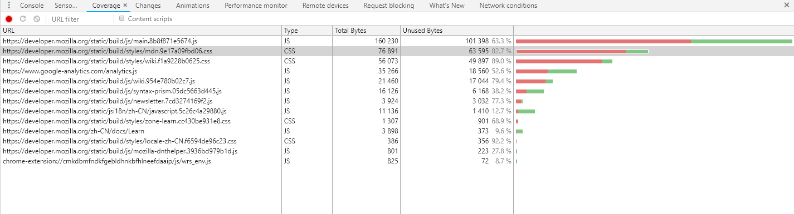

# 优化清单(更新中)

<!-- TOC -->

- [优化清单(更新中)](#优化清单更新中)
  - [1 前端优化](#1-前端优化)
    - [1.1 减少 HTTP 请求数](#11-减少-http-请求数)
    - [1.2 减少/优化 DNS 查询](#12-减少优化-dns-查询)
    - [1.3 避免重定向](#13-避免重定向)
    - [1.4 资源缓存](#14-资源缓存)
    - [1.5 提高并行下载数](#15-提高并行下载数)
    - [1.6 资源预加载](#16-资源预加载)
    - [1.7 资源体积优化](#17-资源体积优化)
    - [1.8 AppShell](#18-appshell)
    - [1.9 CSS 优化](#19-css-优化)
  - [2. 前端运行时优化](#2-前端运行时优化)
  - [3. 服务端优化](#3-服务端优化)
  - [4. 客户端优化](#4-客户端优化)
  - [5. 开发和协作规范](#5-开发和协作规范)
  - [6. 鉴权规范](#6-鉴权规范)
  - [性能测试和审计工具](#性能测试和审计工具)
  - [参考文献](#参考文献)

<!-- /TOC -->

<br/>

不管是 PWA 还是用 Webview Hybrid 的方式, 除了缓存我们还需要做很多的优化, 才能确保更好的应用体验

<br/>

## 1 前端优化

### 1.1 减少 HTTP 请求数

HTTP1 创建和销毁连接是需要一定开销的(如 TCP 连接初始化，SSL 握手等), 另外浏览器对域名有请求数的限制， 所以合理地减少 HTTP 的请求数可以加快页面的加载速度. 主要手段有:

- **合并文件**：比如合并 JS， CSS 文件
- **合并图片**: 在早年的前端开发中，我们会使用到`CSS Sprite`, 它将多个小图片(一般是图标)合并成一张图片, 然后使用`background-position`来定位具体的文件。例如 google 首页的 CSS Sprite:

  

  在移动互联网时代，手机屏幕的分辨率越来越高，使用位图图标的显示效果并不太好, 而且处理不太灵活，所以又出现了其他图标处理方法：

  1.  **font icon**: 图标字体。这是自定义的图标字体，可以像普通字体一样被使用，比如设置大小，设置字体颜色，变换效果等等。这当中最为出名的是`Font Awesome`. 另外`Ionic`, `Bootstrap`, `Antd`这类组件都有提供图标字体。可以使用[阿里巴巴矢量图标库](http://iconfont.cn/)在线服务来下载和生成自己的字体文件.
  2.  **svg sprite**: 一般场景下，我们不会自己去生成图标字体，因为制作图标字体相对而言比较麻烦。svg 可以通过 symbol 形式批量定义， 然后内嵌或引入到 html 中，然后就可以在 html 内任意引用。和`Font Icon`一样可以被 CSS 处理。

- **内联图片**：一些提交比较小的图片，可以转换成 data:url 形式(即 base64 二进制形式)，内嵌到文档中。这可以较少请求。但是要注意的是这种图片不会被缓存，而且每次加载都需要解析 data:url. `Webpack`的`file-loader`默认会将小于 10k 的文件转换成 data:url 形式
- **惰性加载图片**: 对于图片密集型的应用，首屏会有很多图片加载。这可能会挤占并行下载数，对于这些图片，可以考虑惰性加载的策略。
- **keep-alive**: 资源服务器开启`keep-alive`可以尽可能复用 TCP 连接

<br/>
<br/>

### 1.2 减少/优化 DNS 查询

DNS 查询也是需要花费一些事件的，尤其是没有命中缓存的情况下。大多数浏览器都会有自己的缓存，如果没有命中缓存(或过期)，就会向操作系统请求，如果操作系统没有命中则向外部的 DNS 服务器请求。

需要注意的是，大部分大型网站都会使用多个域名来分发不同类型的资源，这是因为浏览器的并行下载限制是针对一个域名而言的，使用多个域名可以提高并行下载的数目,

可以通过**预加载 DNS**的形式来优化 DNS 查询。详见[1.6 资源预加载](#16-资源预加载)

<br/>
<br/>

### 1.3 避免重定向

在[现状，瓶颈分析](problems.md)中我们分析过，我们大部分应用在呈现之前需要两次重定向。在重定向时浏览器是没有东西可以渲染的。另外发起连接也需要一定的开销，所以会导致较长的白屏时间.

<br/>
<br/>

### 1.4 资源缓存

对于资源缓存的细节在[预选方案对比和分析](compare.md)中以及描述得很清楚. 这里列举一些额外的优化技巧:

1.  设置 favicon.icon. 浏览器在每次加载页面时都会加载 favicon.icon, 即使你没有在\<head\>中声明它。如果你有 favicon，需要设置一个较长的缓存时间，已经尽可能缩小体积。如果没有 favicon，可以使用下列代码来避免发起请求:
    ```html
    <link rel="shortcut icon" href="data:image/x-icon;," type="image/x-icon">
    ```

<br/>
<br/>

### 1.5 提高并行下载数

对于大型网站，一般会将资源分布在多个域名，来最大化并行下载速度。但是使用过多的域名也会使 DNS 查询的开销变大。为了在两者之间平衡，最佳的不同域名数应该控制在 5 个以内

<br/>
<br/>

### 1.6 资源预加载

资源的预加载是一种很好的性能优化方法。通过预测用户的行为，预加载部分资源，来提高资源的加载速度. 目前支持预加载类型有:

- **DNS-prefetch**: 让浏览器主动去查询 DNS，提高后续请求的 DNS 获取速度

  开启 DNS 预查询(这一步可以由服务器控制):

  ```html
  <meta http-equiv="x-dns-prefetch-control" content="on">
  ```

  声明预查询的域名:

  ```html
  <link rel="dns-prefetch" href="http://www.mygzb.com/">
  ```

- **preconnect**: 预连接, 预先建立一个连接，准备好 DNS 查找，TCP 握手以及 SSL 协商等开销

  ```html
  <link rel="preconnect" href="//example.com">
  <link rel="preconnect" href="//cdn.example.com" crossorigin>
  ```

- **prefetch**: 预获取, 让浏览器预先请求该资源并放入浏览器的缓存中

  ```html
  <link rel="prefetch" href="//example.com/nextpage.html" as="html" crossorigin="use-credentials" />
  ```

  其他规则见[参考文献](#参考文献)

<br/>
<br/>

### 1.7 资源体积优化

- **体积优化**: 资源的体积会影响`下载速度`和`解析速度`. 比如一个*600kb*的 JS 文件在 Chrome 桌面环境下解析的速度为*150ms*，对于移动端或性能较弱的设备或浏览器，这个时间会更长。常见的优化手段有：

  1.  使用较为轻量的工具或框架。
  2.  压缩文件。

      - css: 比如 cssnano 压缩 CSS 文件
      - 图片压缩
      - JS：使用 uglifyjs 压缩。这不仅是一个文本压缩工具，还是一个运行时优化工具，他可以优化你的代码，比如去除不必要的语句。
      - 去除重复的代码
      - 去除未使用的代码。较新的 Chrome 开发工具可以检测未被应用的 CSS/JS 代码, 可以作为依据，去除未使用的代码.

        

  3.  代码优化: 对于 JavaScript, 除了前面介绍的 uglifyjs，facebook 开源的[`Prepack`](https://prepack.io/)工具可以进一步优化 JS 的运行时性能和文件体积. Prepack 是一个部分求值器(Partial Evaluator), 简单的说，就是把能在编译时求值的操作，在编译时进行求值， 从而优化运行时的运行性能. 例如:

      

      对于 CSS，可以使用 Sass，PostCSS 等预编译器，来提高 CSS 编写效率。但是使用这类工具并不能有效优化 CSS 代码，没有良好的代码规范和认识，都会写出面条式的 CSS 代码. 对于单页应用，还推荐**CSS-in-JS**方案，这类方案的典型代表有`style-components`. 好处有:

      - 更加动态，更灵活
      - 组件化, 可以惰性加载
      - 避免纯 CSS 的坑, 换句话说，避免写出面条式的 CSS 代码，也没有关于类命名方面的烦恼和争论
      - 体积更小。比如纯 CSS 在编译时出于兼容性考虑会添加厂商前缀， 从而增加文件体积。使用 CSS-in-JS 方案可以在运行时处理

      缺点：

      - 需要引入运行时
      - 失去`叠层样式`优势，样式复用和继承的优势没有体现出来

      <br/>
      <br/>

- **拆包，惰性加载**: 单页应用相比传统后端渲染页面的缺点在于其首次加载体验较慢. 有很多代码或样式在首次加载时并不是必须的， 将这些资源抽取出来，按需加载可以提升首屏渲染的速度。这里就涉及到拆包问题, 拆包有两个粒度:

  1.  路由级别: 按照前端路由进行拆包, 当跳转到这个路由时再去加载
  2.  组件级别: 对于那些不会即刻需要展示的组件，比如 Modal, 隐藏的菜单. 都可以拆出来，按需加载


      <br/>
      <br/>

- **资源加载顺序**: 这是一条比较基础的规则:

  1.  将 CSS 引用放在\<head\>
  2.  将 JavaScript 的\<script\>放在\<body\>的底部。

  这条规则在传统服务端渲染页面中很适用，理解这条规则，需要理解浏览器的加载原理:

  ```html
  <html>
    <head>
      <link rel="stylesheet" href="app.css" />  <!-- A -->
    </head>
    <body>
      <script src="/app.js"></script>  <!-- B -->
      <main>                              <!-- C -->
        <h1>hello world</h1>
      </main>
    </body>
  </html>
  ```

  当浏览器接收到 html 页面时就会开始至上而下解析它.

  1.  首先在 `A` 处遇到样式表加载，由于样式表在理论上不会影响 DOM 树，所以'一般情况下'不会阻止 html 的解析
  2.  到达 `B` 处，浏览器会阻塞在这里加载 app.js 文件，并在下载完之后同步执行。
      如果在 app 执行时 app.css 没有执行完，浏览器就会禁用脚本执行，并等待样式加载完毕。 这是因为脚本可能会访问样式信息，为了防止脚本获取到错误的样式信息，浏览器一般会禁用脚本执行并等待样式加载。
  3.  所以 `C` 这里的只能等待 `B` 被执行完之后才能渲染出来

  由上可以得出两个结论:

  1.  样式表在'某些情况'下会阻塞 html 的解析. 所以我们一般会将其放在 head 的顶部， 让其更快加载出来；同时放在 head 中也可以让样式第一时间可以应用到页面上
  2.  脚本会阻塞 html 的解析, 我们将它放在 body 底部的原因是为了让内容更快地渲染出来， 减少白屏的时间.

<br/>
<br/>

### 1.8 AppShell

典型的单页应用的 html 文件结构是这样的：

```html
<html>
 <head>
   <link rel="stylesheet" href="app.css" />
 </head>
 <body>
   <div id="root"></div>
   <script src="app.js"></script>
 </body>
</html>
```

这是一个空白的页面，只有等到 app.js 加载并执行完成之后，用户才可能看到东西。App Shell 模型就是为了在脚本加载完成之前，让用户能看到点东西，消除白屏时间，从而提高用户体验。改造上面的 html 文件, 例如:

```html
<html>
 <head>
   <link rel="stylesheet" href="app.css" />
 </head>
 <body>
   <div id="root">
     <div>侧边栏</div>
     <div>正在加载..</div>
     <div>标题栏</div>
   </div>
   <script src="app.js"></script>
 </body>
</html>
```

`饿了么`PWA应用的App Shell


实现 App Shell 有以下集中方式:

- 手动模式。手动编写 index.html, 为每个应用定制一个 App Shell.
- 编译时预渲染. 在编译时，使用服务端渲染的机制，对某些路由生成初始化页面.
- 服务端渲染(SSR). 一般和 NodeJS 配合，实现同构化的应用.

<br/>
<br/>

### 1.9 CSS 优化

- **设计类字体**: 对于设计类字体可以通过图片或者字体的方式实现：
    1. 使用图片的方式可以高精度还原，兼容性强。但是改动麻烦，扩展性差，非矢量适配高清屏麻烦
    2. 字体方式，扩展性强。但是不同浏览器存在渲染差异，兼容性略弱。字体库可能较大，需要切割, 抽取需要的字体. 抽取字体可以使用[`fontmin`](http://ecomfe.github.io/fontmin/)工具


<br/>
<br/>


## 2. 前端运行时优化

- DOM 操作优化
- CSS 优化

<br/>
<br/>

## 3. 服务端优化

- 开启静态资源缓存
- 开启 Gzip
- 使用 nginx 单独部署静态资源, 动静分离
- CDN 部署资源
- 减少 Cookie 的体积
- 使用流式(stream)的响应, 尽快将准备好的部分资源返回给浏览器
- HTTP2
- 延迟鉴权, 使用 Token 方式鉴权

<br/>
<br/>

## 4. 客户端优化

- 预加载 webview, 参考[WebView 性能、体验分析与优化](https://tech.meituan.com/WebViewPerf.html)
- 页面预加载, 让应用缓存下来, 例如开启一个隐藏的 webview 页

<br/>
<br/>

## 5. 开发和协作规范

- 文档规范
- 开发优化, 前后端协作规范
- 区分开发环境和生产环境

<br/>
<br/>

## 6. 鉴权规范

- Token 和 Session 对比分析

  - Token 优势
    - 支持跨域
    - 开发环境下容易模拟, 特别是在应用这种没有登录界面的场景.
    - Session 基于相比 cookie, cookie 安全性较低, 比如容易 CSRF 攻击.
    - 在一些平台, 如 React Native, 根本就不支持 cookie 存储
    - 可以实现服务端无状态化, Token 自包含鉴权信息

- 鉴权流程优化提议

<br/>
<br/>

## 性能测试和审计工具

1. Chrome Devtools. 可以使用Chrome开发者工具的Performance和Audits来进行性能分析
2. 统计。可以使用Baidu统计或者Google Analysis对用户行为和页面性能进行统计

## 参考文献

- [2018 前端性能优化清单](https://juejin.im/post/5a966bd16fb9a0635172a50a)
- [雅虎网站性能优化最佳实践](https://github.com/creeperyang/blog/issues/1)
- [前端性能优化 - Resource Hints 资源预加载](https://juejin.im/post/5a52d5d06fb9a01cbd586eb6)
- [前端优化实践](https://juejin.im/entry/58474862a22b9d007aaa8066)
- [前端优化不完全指南](https://aotu.io/notes/2016/03/16/optimization)
- [H5 性能优化方案](https://mp.weixin.qq.com/s/pEKpjAhwDMIKQ4fzxix2eQ)
- [移动 H5 首屏秒开优化方案探讨](https://blog.cnbang.net/tech/3477/)
- [移动端本地 H5 秒开方案探索与实现](https://mp.weixin.qq.com/s/0OR4HJQSDq7nEFUAaX1x5A)
- [Optimising the front end for the browser](https://medium.com/m/global-identity?redirectUrl=https://hackernoon.com/optimising-the-front-end-for-the-browser-f2f51a29c572)
