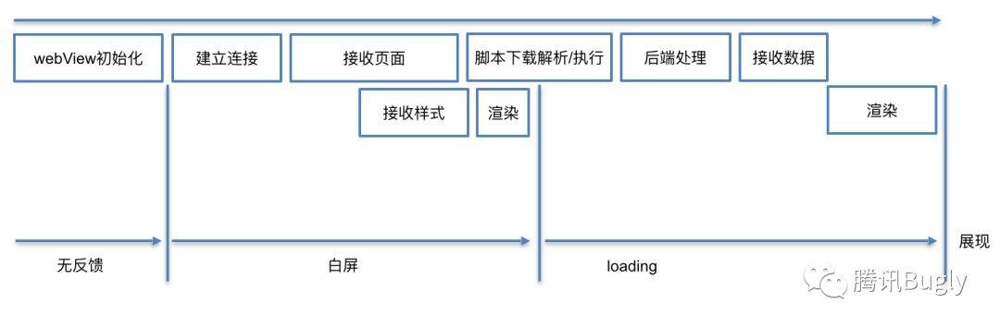
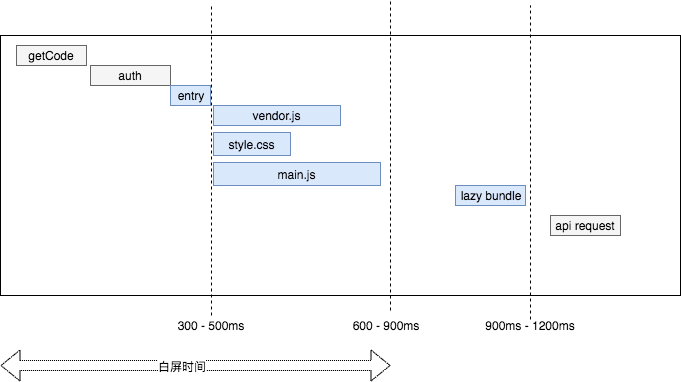
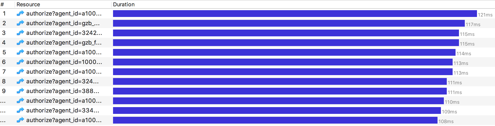
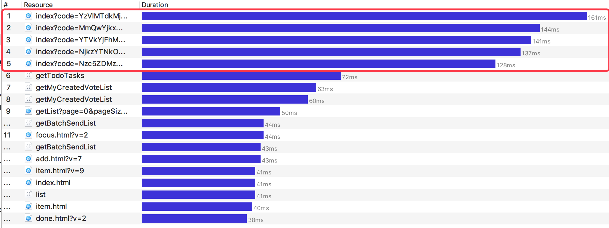
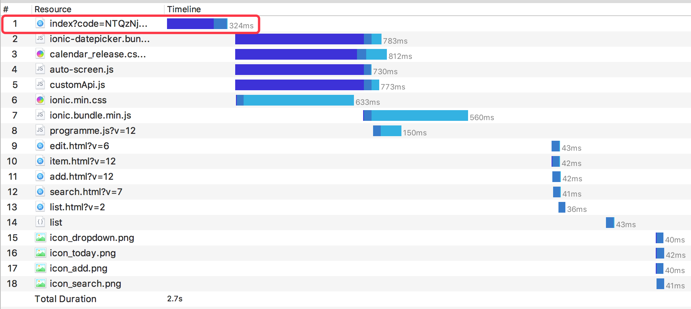
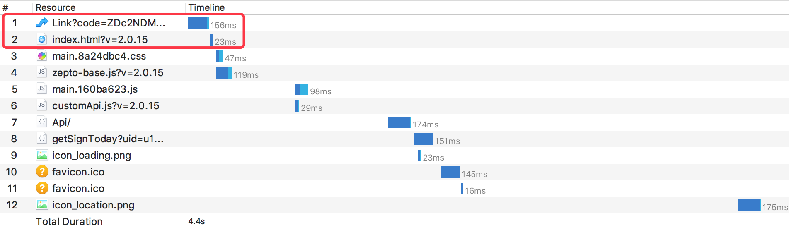
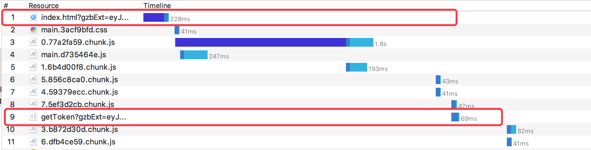
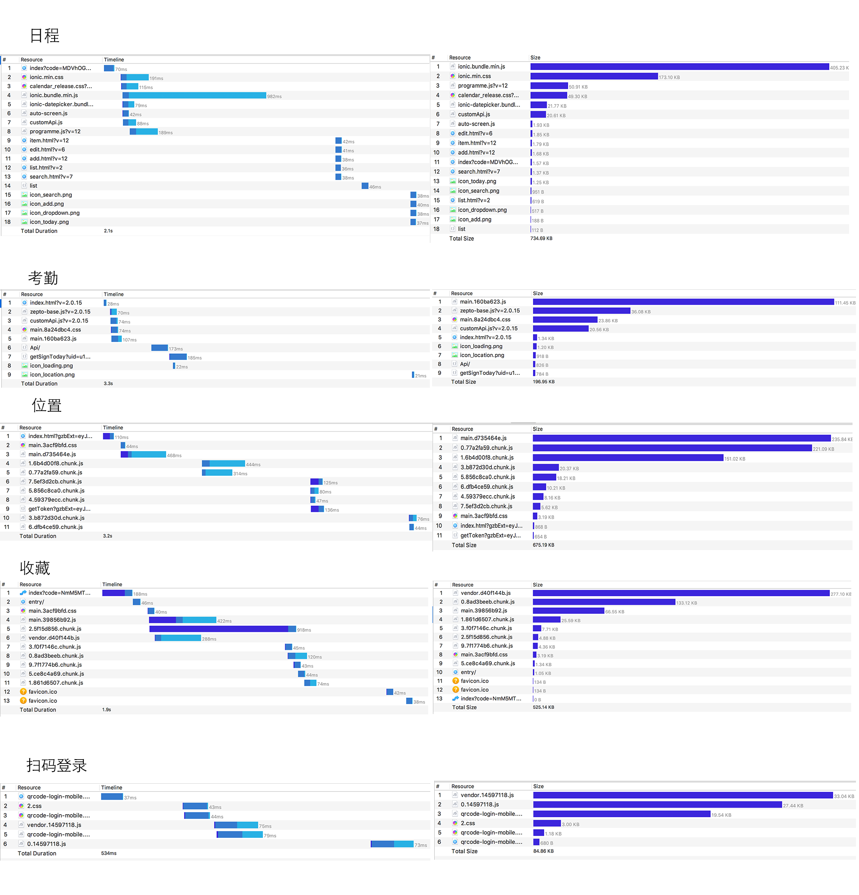
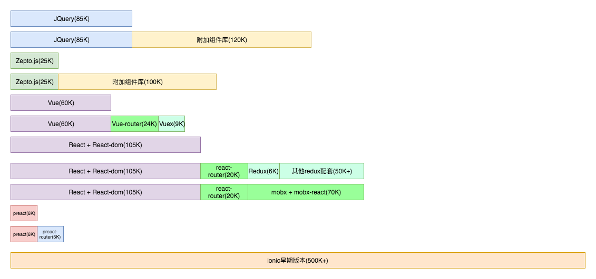

# 现状，瓶颈分析

本节旨在分析应用加载过程中的瓶颈和应对措施

## 1.应用加载过程

先从整体看一个页面的加载过程 :

一个 HTML5 应用都会经历以上过程. 应用'加载慢'的问题, 主要是因为白屏时间过长. 从上图可出 白屏区间的主要工作是

1.  webview 初始化. 这个优化的空间很小, 具体依赖设备的性能和资源情况
2.  建立连接. 建立连接依赖于 网络情况, 服务器情况, 以及 DNS 等情况. 这里的优化空间, 主要有减少连接数, 减少重定向数以及预解析域名手段
3.  接收页面, 以及其他静态资源. 静态资源的体积, 除了影响下载速度, 还会影响解析速度.
    依赖于服务器情况, 网络情况, 以及文件体积.主要的优化手段是缓存, 压缩, 简化程序减少体积, 开启 gzip,服务端渲染等手段,

具体看一下我们工作宝应用是如何加载的:

> 注: 以下数据以工作宝 Android 6.0 测试. 服务由阿里云提供

1.  首先`客户端`会携带一些会话信息(用户，当前语言，重定向 url)，以及向`EIM`进行认证并获取一个`Code`

    
    平均消耗在 115ms 左右

2.  EIM 响应，让浏览器携带 code 重定向应用服务器地址。应用服务器会在这里对 Code 进行解析和鉴权。并将用户信息保存在 session 中。

    
    平均消耗在 140ms 左右

    目前已存在的应用中对于 Code 有三种处理方式：

    * `日程`为代表的：鉴权完成同时返回页面(html)，浏览器可以直接渲染出来. 即直接通过 Java 的 template 渲染将页面，并在页面中携带用户信息
      

    * `考勤`为代表的: 鉴权完成后返回 302，让浏览器重定向获取 APP 的 index.html 入口
      

    * `位置`为代表的：从 EIM 获取到 Code 之后，直接跳转到 index.html 入口. 然后通过 getToken 和应用后端换取 Token, 后续使用 Token 的方式进行鉴权
      

    对比:

    * `日程`鉴权完成后立即返回页面, 是优于`考勤`的。考勤使用重定向的方式会让浏览器浪费一次请求. 但是基于当前前端应用的构建方式，html 文件是构建工具自动生成的。所以`考勤`的方式更方便一点
    * 而`位置`应用使用的方式则弥补了前面两者缺陷。在拿到 Code 后，马上开始获取页面，在请求资源渲染页面的同时向服务端鉴权。最大化地减少的白屏时间。
    * 更好的方案

3.  拿到 html 页面后，浏览器开始渲染流程。因为我们使用前端渲染的方式，只有等到所有‘必须’的资源加载完毕之后，用户才能看到有东西的页面。这个阶段才是前端能控制的‘主要战场’, 也是这次预研的主题

    
    影响这个阶段页面加载的因素有很多, 主要因素是资源的体积大小和分配情况. 这个阶段我们能做些什么?

    [*] 资源压缩, 压缩 JS 文件, CSS 文件,图片资源等
    [] 服务器 Gzip 压缩(目前没有开启, 开启能压缩 40%以上的文件体积)
    [] 服务器动静分离, 让更专业的静态服务器来伺服静态文件( 比如 Nginx, 目前是 Java). 这个需要基准测试证明
    [] 选择合适的技术栈, 减少依赖和代码重复, 平衡开发效率, 维护效率, 运行性能和首屏性能
    [*] 适当分割文件, 平衡并行下载数和连接数
    [] 缓存优化. 这是本次的主题

## 选型分析

下面是目前前端主流选型的 对比, 暂时不考虑运行性能, 因为随着版本的迭代, React, Vue, Angular 三大框架的性能 已经差距不大. 在本次话题中, 框架及其附属 周边的体积, 影响首屏渲染的成本会高一些:

由上图可以看到, 现代前端框架做了很多工作的同时, 依旧保持苗条的身材. 比如`Vue`的核心, 只有 60KB, 这 60KB 实现了等价于
`React + React-DOM + Mobx + Mobx-React`(180K)的工作.

更为惊艳的是, `Preact` 这款轻量版的 React 只有 8K 大小, 非常适合移动端 的开发. 目前最新开发的应用, 如`扫码登录`, `安全验证`以及`CSP扫码登录`
等都使用了 Preact, 整个应用的体积(包括 业务逻辑代码)可以控制 100KB, 甚至 50KB 以内. 它非常适合这种场景.

由于定位不一样, Angular 等框架 体积都非常庞大. 暂时 不再未来选项之列. Ionic 是一个组件库+运行时, 放在这里比较似乎有点不公平

所以相比而言, `Jquery`或`Zepto.js`以及不具备竞争能力( 目前还有其适用场景).

更多角度的排名:

| 体积(核心) | 体积(+ 周边)              | 生态(+活跃的)      | 运行效率                   | 开发 效率                | 代码量                   |
| ---------- | ------------------------- | ------------------ | -------------------------- | ------------------------ | ------------------------ |
| Preact     | Preact                    | React/Vue          | React/Vue/Augular          | React/Vue/Augular/Preact | React/Vue/Augular/Preact |
| Zepto      | Vue(Vue-Router, Vuex)     | Augular            | Preact                     | AugularJS                | AugularJS                |
| Vue        | Zepto                     | AugularJS/Jquery   | Jquery/Zepto(依赖于开发者) | Zepto/Jquery             | Zepto/Jquery             |
| Jquery     | React(React-Router, Mobx) | Preact(兼容 React) | AugularJS                  |
| React      | Jquery                    | Zepto              |
| Augular    | React(Redux)              |
| AugularJS  | Augular                   |
| Ionic      | AugularJS                 |
|            | Ionic                     |

## 小结

通过上面分析可以得出, 目前应用加载慢的几点主要原因:

1.  获取应用前, 过多重定向. 如考勤和收藏 等应用,在真正获取页面之前 需要两次重定向. 而且这还依赖于客户端的连接情况.
    这经常发生在冷启动客户端时, 客户端有一定几率会卡死在这两次重定向中, 而且对 用户没有任何反馈.
2.  服务器未开启 Gzip. 这个对于静态资源下载来说影响较大
3.  静态资源伺服还有优化空间. 目前应用使用 Java 的 内嵌服务器 Jetty 服务器进行静态资源的伺服, 一般适用于`开发环境`,
    以支持快速开发. 由上面的例子中也可以看到, 静态资源连接的建立,响应的延迟都比较长,且不稳定, 而相比而言, Nginx 更适合静态资源的伺服.
    实现动静分离可以优化 Java 服务器性能和内存占用, 也可以提高静态资源的下载效率 
4.  应用体积还可以进一步优化. 选择合适的框架和裁剪 臃肿的依赖, 以及合理的 拆分, 可以较大的优化静态资源的体积.
5.  首屏优化, 目前加载的 html 页面是空白的, 预渲染应用外壳可以让 用户尽早地看到内容的渲染.

## 参考文献

[嵌入式服务器 jetty，让你更快开发 web](https://cloud.tencent.com/developer/article/1014514)
