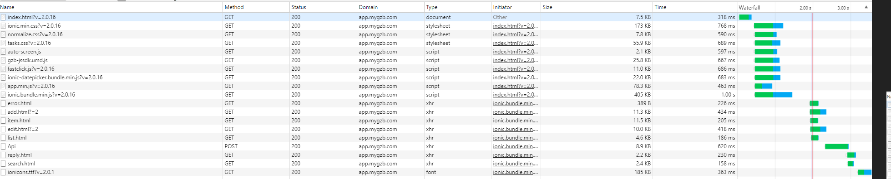
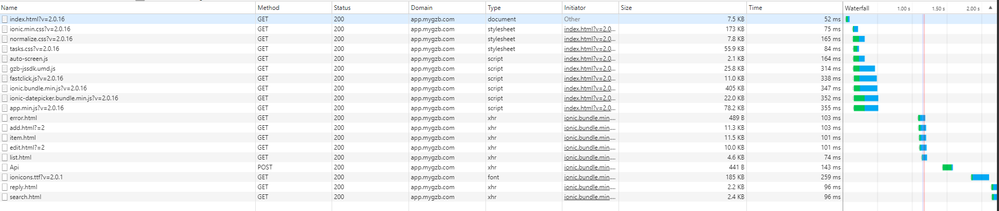
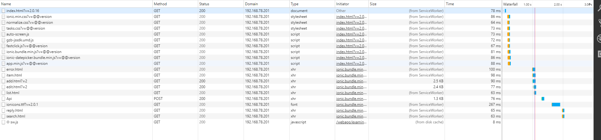

# PWA 审批测试

<!-- TOC -->

- [PWA 审批测试](#pwa-审批测试)
  - [小结](#小结)
  - [PWA 实现参考](#pwa-实现参考)

<!-- /TOC -->

> 一般情况下，我们可以根据两个事件来衡量页面的渲染情况, 尽管最终的效果取决于应用的实现。  
> `蓝线`： DOMContentLoaded 事件，在 Html 文档加载和解析完成后触发, 但是图片和样式表等外部资源可能没有下载完毕。  
> `红线`: load 事件，表示浏览器已经加载完 html 上的所有外部资源, 一般框架会在这个事件触发后开始操作 DOM

> 这里忽略了单点登录的步骤。

首先看一下`审批`应用在阿里云 4G 环境下的无缓存加载情况:

**条件**

- 阿里云
- 4G
- 未开 Gzip

**结论**

单个资源加载耗时在 `500ms-1s`. 在 3s 左右显示可交互页面

 

---

 

在阿里云 wifi 环境下的无缓存加载情况:

**条件**

- 阿里云
- 未开 Gzip

**结论**

单个资源加载耗时在 `100ms-350ms`，在 2.1s 左右显示可交互页面

 

---

 

在 78.201 服务器无缓存加载情况

**条件**

- 78.201
- 开 Gzip

**结论**

单个资源加载耗时在 `50ms-200ms`，在 1.3s 左右显示可交互页面

 

---

 

在 78.201 服务器激活 SW 加载情况

**条件**

- 78.201
- 激活 SW

**结论**

单个资源加载耗时在 `60ms-100ms`, 在 1.2s 左右显示可交互页面

 

---

 

在 Firefox 浏览器激活 SW 的加载情况

**条件**

- 78.201
- 激活 SW
- firefox

**结论**

在 firefox 下单个资源加载几乎是`零延迟`的, 在 1s 之内可以显示可交互页面. 但是

 

---

 

## 小结

表格对比

| 场景           | 单个资源加载时间 | DOMContentLoaded | Load  | 最终交互页面展示时间 |
| -------------- | ---------------- | ---------------- | ----- | -------------------- |
| 阿里云 4G      | 500ms-1s         | 2s               | 2s    | 2.8s                 |
| 阿里云 Wifi    | 100ms-350ms      | 1.3s             | 1.3s  | 2.1s                 |
| 78.201         | 50ms-200ms       | 1.1s             | 1.1s  | 1.6s                 |
| 78.201 PWA     | 60ms-100ms       | 1s               | 1s    | 1.5s                 |
| 78.201 Firefox | 0ms              | 283ms            | 385ms | 1.3s                 |

在 78.201 局域网下测试，开启 PWA 后页面打开体验其实差距不大。但是 PWA 可以在任何网络环境下保证快速和稳定的加载速度。

这也说明 PWA 只是应用优化的其中一个步骤。对于白屏的优化还有许多要做的，具体原因前面的章节已经提过。不管是 PWA 模式还是客户端 Webview 拦截模式，都需要配合**前端应用优化**和**用户体验设计的提升**来提高应用的加载体验.

- 1.  PWA 能做什么
  - 离线缓存静态资源。由于进程间通信和数据传输需要开销，所以资源的请求几乎等价于局域网环境下的资源请求速度.
  - 可靠稳定的请求。即使在弱网环境下获得快速稳定的加载速度
- 2.  PWA 不能做什么
  - CSS, JS 脚本解析速度
  - 页面渲染速度
  - 运行时性能

 
 

## PWA 实现参考

- [ft](https://app.ft.com/index_page/home)
- [flipboard](https://flipboard.com/)
